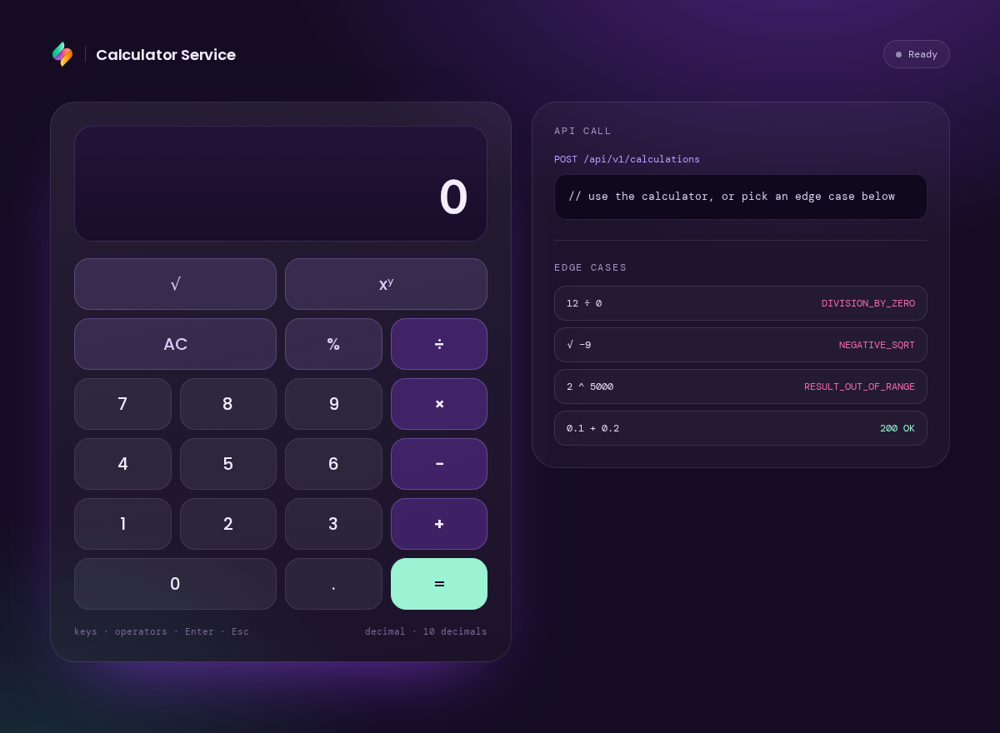
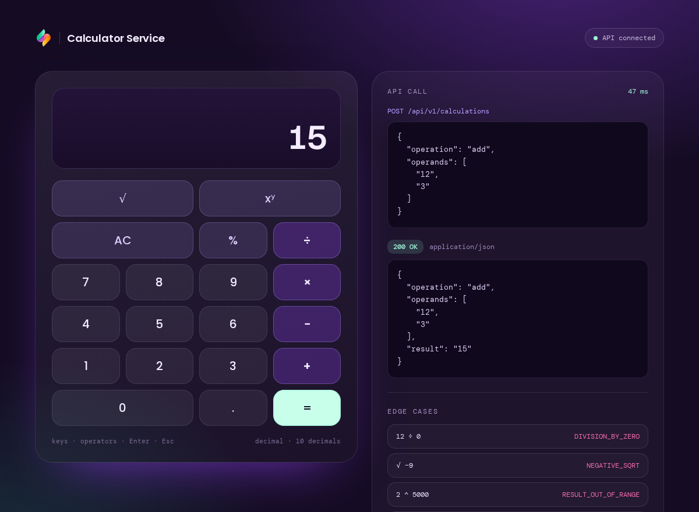
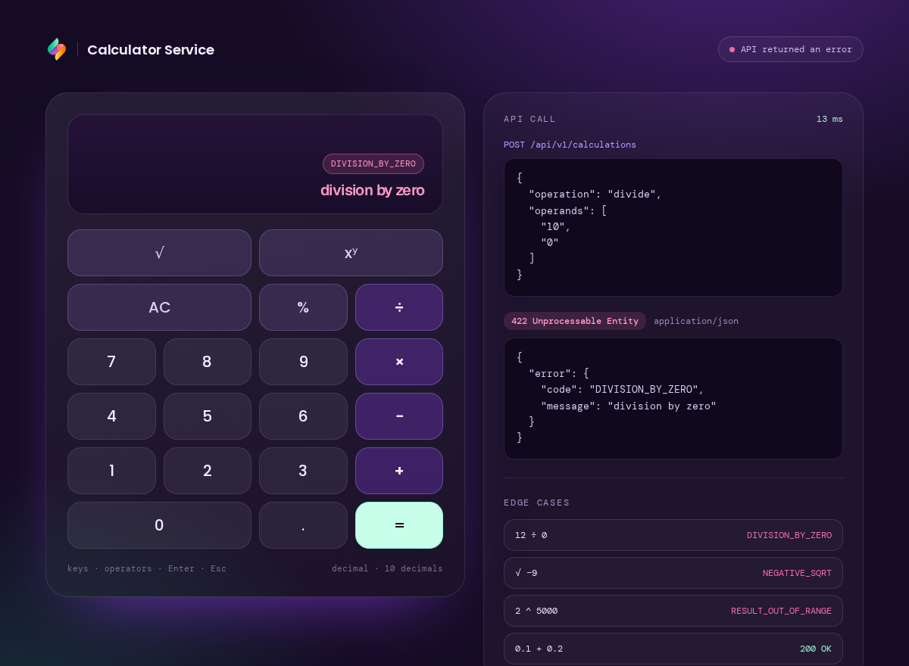

# Fullstack Calculator

A calculator with a Go REST API backend and a React/TypeScript frontend,
built for a recruitment assignment. See [AI_USAGE.md](./AI_USAGE.md) for how
Claude Code was used throughout the build.



## Stack

- **Backend**: Go 1.23, stdlib `net/http` only (no router dependency),
  [`shopspring/decimal`](https://github.com/shopspring/decimal) for exact
  arithmetic.
- **Frontend**: React 19 + TypeScript (`strict: true`), Vite, Tailwind CSS,
  shadcn/ui.
- **Tests**: Go `testing` + `httptest`. Frontend: Vitest + React Testing
  Library.
- **Containers**: multi-stage Dockerfiles per service, `docker-compose.yml`,
  a root `Makefile` as the single entrypoint.

## Quick start

```bash
git clone <this repo> && cd fullstack-calculator
make up   # or: docker compose up --build
```

- Frontend: http://localhost:5173
- Backend: http://localhost:8000
- API docs (OpenAPI/ReDoc, served by the backend): http://localhost:8000/docs

`make up` copies `backend/.env.example` / `frontend/.env.example` to `.env`
automatically on a bare clone — no manual setup step.

### Local development (hot reload)

```bash
make dev   # air for the backend, Vite's dev server for the frontend
```

Or without Docker: `cd backend && go run ./cmd/server`, `cd frontend && npm
install && npm run dev`.

## API

Single resource-shaped endpoint — a calculation is a resource, the operation
is an attribute of it:

```
POST /api/v1/calculations
{ "operation": "divide", "operands": ["10", "3"] }

200 OK
{ "operation": "divide", "operands": ["10", "3"], "result": "3.3333333333" }
```

Operands and results are JSON **strings**, never JSON numbers — a JSON
number decodes to `float64` before `decimal` ever sees it, which would
destroy the precision the whole backend exists to preserve.

| Operation    | Arity | Notes                                    |
| ------------ | ----- | ----------------------------------------- |
| `add`        | 2     | exact decimal                             |
| `subtract`   | 2     | exact decimal                             |
| `multiply`   | 2     | exact decimal                             |
| `divide`     | 2     | exact decimal, rounded to 10 places       |
| `power`      | 2     | `float64`; exponent magnitude capped at 1000 |
| `sqrt`       | 1     | `float64`                                 |
| `percentage` | 2     | `percentage(a, b)` = "a% of b"            |

Every failure uses the same envelope:

```
{ "error": { "code": "DIVISION_BY_ZERO", "message": "division by zero" } }
```

| Status | Codes |
| --- | --- |
| 400 | `INVALID_JSON`, `UNKNOWN_OPERATION`, `INVALID_OPERAND`, `WRONG_ARITY` |
| 422 | `DIVISION_BY_ZERO`, `NEGATIVE_SQRT`, `RESULT_OUT_OF_RANGE` |
| 500 | `INTERNAL` |

`GET /health` returns `{"status":"ok"}` (used by the compose healthcheck).
Full request/response schemas and examples for every code: **[/docs](http://localhost:8000/docs)**
once the backend is running, or [`backend/internal/api/openapi.yaml`](./backend/internal/api/openapi.yaml)
in the repo. The running app also has a live "API call" panel demonstrating
four of these edge cases (division by zero, negative sqrt, the exponent cap,
and a `0.1 + 0.2` precision check) against the real backend.

## Design decisions

- **Decimal, not `float64`.** This reads as a payments-adjacent assignment,
  so exact arithmetic is the default (`add`/`subtract`/`multiply`/`divide`
  via `shopspring/decimal`). `sqrt`/`power` fall back to `float64` because
  there's no exact decimal algorithm for an irrational result — a
  deliberate, stated trade-off, not an oversight.
- **One endpoint, not seven.** `POST /api/v1/calculations` dispatches on an
  `operation` field instead of routing `/add`, `/subtract`, etc.
  Per-operation routes are RPC wearing REST's clothes: seven near-identical
  handlers invite the kind of drift where one gets a fix and the others
  quietly don't. The cost — the request body loses per-operation field
  names (`{base, exponent}` becomes `operands: []`) — is mitigated by
  server-side arity validation and a client-side discriminated `Operation`
  union.
- **`useReducer`, not scattered `useState`.** The calculator's state is a
  discriminated union (`entering_first` / `awaiting_second` /
  `entering_second` / `computing` / `result` / `error`) driven by a single
  reducer, specifically to rule out a class of bug by construction — a
  dead "backspace after picking an operator," or `=` computing
  `first OP first` with no second operand, is a compile-time-adjacent
  impossibility here rather than a runtime bug waiting to happen.
- **`requestId`-guarded async.** Every calculation (however triggered —
  keypad, keyboard, or an API-panel edge case) carries an incrementing
  `requestId`. A `RESOLVED`/`REJECTED` action is discarded unless it
  matches the state's current `requestId`, so a slow response that arrives
  after a newer calculation has already started can never overwrite it.
- **Percentage operand swap.** The API is literal — `percentage(a, b)`
  means "a% of b." The keypad enters it the other way (`200`, `%`, `50` →
  50% of 200) to match a physical calculator; the swap happens client-side,
  once, at the call site.
- **Walking skeleton first.** `docker compose up` worked end-to-end (both
  services, healthcheck-gate) before any real
  backend or frontend feature was written — see `AI_USAGE.md` for the full
  phase-by-phase build order.
- **Single `main` branch.** Scoped to this assignment's size and solo
  authorship; conventional commits (`feat:`, `fix:`, `docs:`, `test:`,
  `chore:`, `ci:`) keep the history legible without a branching model that
  would only add ceremony here.

## Testing

```bash
cd backend && go vet ./... && go test ./... -cover
cd frontend && npm run lint && npx vitest run --coverage && npm run build
```

Backend coverage: `internal/calc` 95.5%, `internal/api` 90.0%.
`cmd/server` is intentionally lower (~16%) — `main()`'s signal-handling
loop isn't meaningfully unit-testable and isn't where the risk lives.

Frontend coverage: ~92% statements. `reducer.ts` and `api/client.ts` are
fully covered, including the race-condition guard and every error path.
`Header`/`ApiPanel` are presentational-plus-integration components verified
by live browser testing against the real backend (see `AI_USAGE.md`) rather
than by unit tests, given the assignment's time budget.

`make test` runs both. `make test-docker` runs each suite inside its
Dockerfile's `builder` stage, since the shipped production images are
stripped of the Go/Node toolchain and source.

## Assumptions / out of scope

Persistence, calculation history, auth, multi-user support, operator
chaining beyond one operation per request, i18n, and rate limiting are all
out of scope for this assignment.

## Screenshots

| Idle | Result | Error |
| --- | --- | --- |
|  |  |  |
